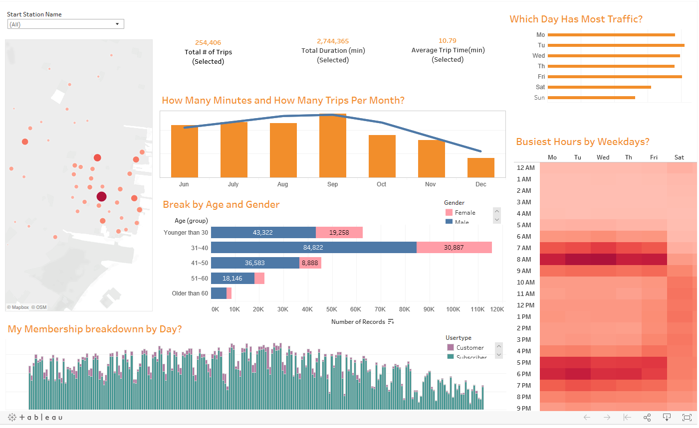

# Citi_Bike_Analytics

### Task

This project is dedicated to the New York Citi Bike sharing program. The data which is collected end renewed monthly, can be found on the : [Citi Bike Data]
(https://www.citibikenyc.com/system-data) webpage.

#### There are 6 datasets that were used in the analysis

* Ride Data from New York (July 2019 - Dec 2019), a Public version of Tableau has a limit of 15 millions rows for a single dataset, therefore this dataset has a smaller time span.

#### Tableau Dashboards

* Tableau Dashboards [here]
(https://public.tableau.com/profile/yan6855#!/vizhome/CitiBike_dashboard1/Dashboard1?publish=yes)

### Tableau workbook description
---

#### Total Rides Info Dashboard

* The most busy day are weekdays and the most busiest hour during weekdays are from 6 A.M ~ 9 A.M. and afternoon 5 P.M. ~ 7 P.M. Saturday and Sunday are not as busy as weekdays.
* From June to July, the use of citi bike are decresaing, the highest use season is Augest.
* Age between 31 ~ 40 are the main customer, and most of the case. Male user are much larger than female user. There are just few customer still cue bike order than 60
* Both Subscribers and Customers are decrcreasing after Octomber. 
